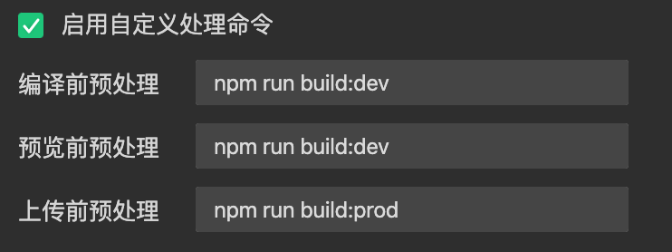
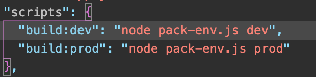

# 微信小程序

[toc]

首屏不要加载过多css和js文件，否则容易白屏

1. 建议vue-router懒加载其他路由，懒加载组件，懒加载图片（ **VUE图片懒加载-vue lazyload插件的简单使用**）

2. 另外库等采用cdn引用

针对小程序文件的一些解释，主要文件分为这4类。

1. `.json` 后缀的 `JSON` 配置文件
2. `.wxml` 后缀的 `WXML` 模板文件
3. `.wxss` 后缀的 `WXSS` 样式文件
4. `.js` 后缀的 `JS` 脚本逻辑文件

接下来我们分别看看这4种文件的作用。

## .json文件

JSON 是一种数据格式，并不是编程语言，在小程序中，JSON扮演的静态配置的角色。

这里简单主要解释app.json和 logs.json文件

### 1. app.json

该文件是当前小程序的全局配置，包含了小程序的所有页面路径、界面表现、网络超时时间、底部导航tab等。

```json
// app.json主要就是包含pages和window对象，
// 当然还有其他的
{
  "pages":[
    "pages/index/index",
    "pages/logs/logs"
  ],
  "window":{
    "backgroundTextStyle":"light",
    "navigationBarBackgroundColor": "#fff",
    "navigationBarTitleText": "Weixin",
    "navigationBarTextStyle":"black"
  }
}
```

##### 其中 pages字段含义：

小程序的所有页面路径，让微信客户端知道小程序页面定义在哪个目录。

window字段：定义所有页面顶部的背景色，文字颜色等。

[app.json的其他配置](https://developers.weixin.qq.com/miniprogram/dev/framework/config.html)

### 2. 各个页面的配置page.json

这里的page.json指的是目录 pages/logs下的logs.json 

可以独立的定义每个页面的颜色等属性，是否允许刷新等等。


### WXML模板

充当html的角色。

区别：

1. 标签名

   view, button,, text等

2. 存在 wx: if 类似 v-if, {{ }}语法

### WXSS样式

和css类似，区别有二：

1. 新增尺寸单位 rpx，免去换算。但底层采用浮点计算，可能略有偏差
2. 提供全局样式、局部样式。 这个和app.json 、page.json概念相似。app.wxss就是全局的样式，page.wxss就只对它当前的那个页面生效
3. wxss支持部分css选择器

js逻辑交互

```html
<view>{{ msg }}</view>
<button bindtap="clickMe">点击我</button>
```

点击 `button` 按钮的时候，我们希望把界面上 `msg` 显示成 `"Hello World"`，于是我们在 `button` 上声明一个属性: `bindtap` ，在 JS 文件里边声明了 `clickMe` 方法来响应这次点击操作：

```js
Page({
  clickMe: function() {
    this.setData({ msg: "Hello World" })
  }
})
```


微信小程序正式环境测试环境区分方法

1. 启用自定义处理命令

   
   
2. 添加脚本 ( package.json )文件

   

3. 编写一个打包脚本，放在根目录下，运行后的脚本会在本地生成一个env.js文件

   ```js
   var fs = require("fs")
   const env = process.argv.slice(2)[0]
   // 获取环境 test or prod..
   
   const envMap = {
     prod: {
       ENV: 'prod',
       API: 'https://mcenter.fscut.com/api',
       HOST: 'https://wxc.fscut.com/mymachine'
     },
     test: {
       ENV: 'test',
       API: 'https://mcenter.bcjgy.com/api',
       HOST: 'https://wxc.bcjgy.com/mymachine'
     }
   }
   
   // 获取当前环境对象
   const config = envMap[env]
   
   fs.writeFile(
     "env.js",
     `/* eslint-disable */
     // 这里输出的便是环境变量对象，在需要的地方引入env.js就行
     export const envConfig = ${JSON.stringify(config)}`,
     function(err) {}
   );
   ```

4. 在需要使用环境变量的地方引用env.js,如果后续是多套环境可以在dev环境下在小程序中写一个切换请求域的组件

   ```js
   const env = require('../../env.js')
   
   Page({
     data: {
       url: "",
     },
     onLoad: function (options) {
       let data = "2020-01-27"
       this.setData({
         url: `${env.envConfig.HOST}/#/task/list?gmid=0&searchdate=${data}`
       })
     },
   
   })
   ```

   